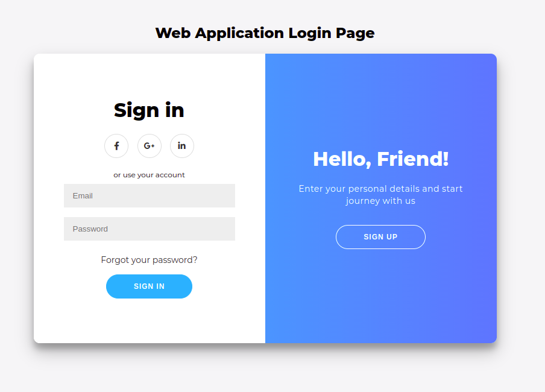
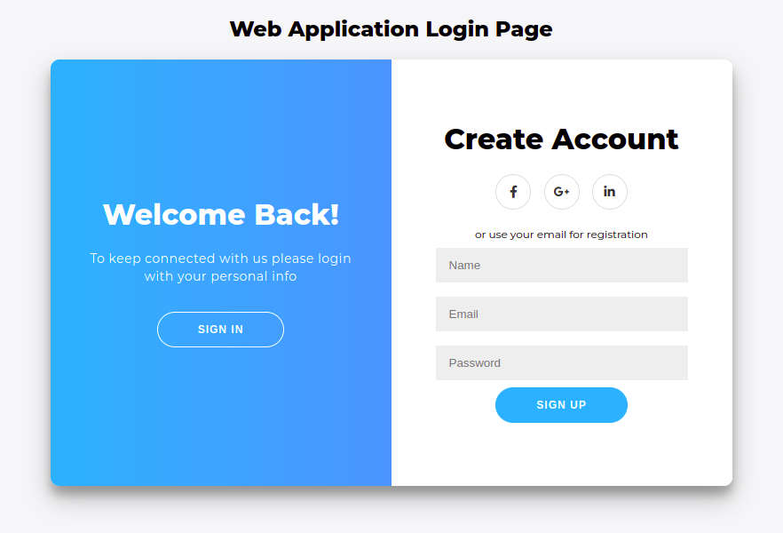

# Secured WebToy

WebToy is a simplified login/signup secured web application. The Front End is developed in HTML, CSS and vanila JS. It's connected to the backend Postgres Database using NodeJS.

## Web App Login Screen

## Web app Signup Screen

